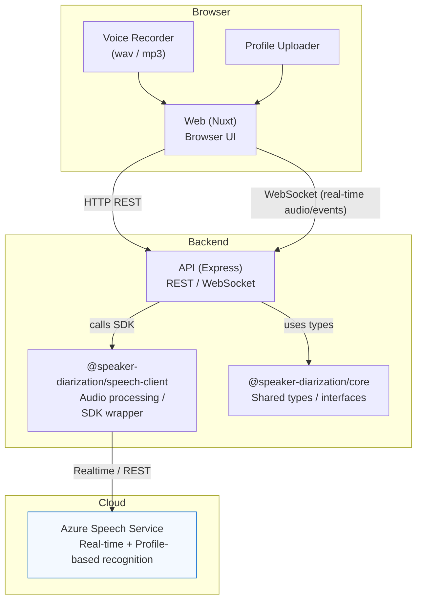

# Azure Speech Service Profile-Based Speaker Diarization

Azure Speech Service の話者分離（Diarization）機能を使用して、事前登録した音声プロフィールに基づく話者認識を実験するWebアプリケーション。

## 🎯 主な機能

- **音声プロフィール管理**: WAV/MP3ファイルのアップロードまたはブラウザ録音で音声プロフィールを作成
- **リアルタイム話者認識**: マイク入力をリアルタイムでAzure Speech Serviceに送信し、話者を識別
- **話者分離タイムライン**: セッション結果をタイムライン形式で可視化

## 📁 プロジェクト構成

このプロジェクトはnpm workspacesによるMonorepo構成です：

```
/
├── apps/
│   ├── web/          # Nuxt 4 フロントエンド
│   └── api/          # ExpressJS バックエンド
├── packages/
│   ├── core/         # 共通型定義・ユーティリティ
│   ├── speech-client/# Azure Speech SDK ラッパー
└── specs/            # 仕様書
```

## 🚀 セットアップ

### 前提条件

- Node.js 22.x LTS（VOLTA推奨）
- npm 10.x 以上
- Azure Speech Service リソース（APIキーとエンドポイント）

### インストール

```bash
# リポジトリをクローン
git clone https://github.com/pa-y-kunimoto/Azure-Speech-Service-Profile-Diarization.git
cd Azure-Speech-Service-Profile-Diarization

# 依存関係をインストール
npm install

# 環境変数を設定
cp .env.example .env
# .envファイルを編集してAzure認証情報を設定
```

### 環境変数

`.env`ファイルに以下を設定：

```bash
# Azure Speech Service (必須)
SPEECH_KEY=your-azure-speech-key
SPEECH_ENDPOINT=https://your-region.api.cognitive.microsoft.com/

# アプリケーション設定
NODE_ENV=development

# セッションタイムアウト設定（オプション）
# SESSION_TIMEOUT_MINUTES: セッション全体のタイムアウト（分）
#   デフォルト: 15分
#   範囲: 1-120分、0 = 無制限
# SILENCE_TIMEOUT_MINUTES: 無音検出タイムアウト（分）
#   デフォルト: 5分
#   範囲: 1-120分、0 = 無効
# ALLOW_SESSION_EXTEND: セッション延長を許可するか
#   デフォルト: false
#   true にすると延長ボタンが表示され、セッションを延長できます
SESSION_TIMEOUT_MINUTES=15
SILENCE_TIMEOUT_MINUTES=5
ALLOW_SESSION_EXTEND=false
```

## 💻 開発

### Docker Compose（ローカルコンテナ）

- **前提**: `Docker` と `Docker Compose` がインストールされていること。
- プロジェクトルートの `docker-compose.yml` を使って、フロントエンドとバックエンドを同時にコンテナで起動できます。

- 起動（フォアグラウンド、ログをそのまま見る）:

```zsh
# プロジェクトルートで実行
docker compose up --build
```

- 起動（デタッチ / バックグラウンド）:

```zsh
docker compose up -d --build
```

- サービス単体で起動する場合（例: `api` または `web`）:

```zsh
docker compose up --build api
docker compose up --build web
```

- 停止・クリーンアップ:

```zsh
# 停止
docker compose down

# ボリュームを含めて完全にクリーンにする
docker compose down -v
```

- ログの確認:

```zsh
docker compose logs -f --tail=200
# 特定サービスのログ
docker compose logs -f api
```

- 注意点:
	- ルートにある `.env` を用意しておくとコンテナで同じ環境変数が参照されます。
	- デフォルトの公開ポートはフロントエンドが `http://localhost:3002`、バックエンドが `http://localhost:3001` です。
	- ポートが競合する場合は `.env` や `docker-compose.yml` のポート設定を変更してください。

### 開発サーバーの起動

```bash
# 全サービスを起動
npm run dev

# 個別に起動
npm run dev --workspace=apps/api  # バックエンドAPI
npm run dev --workspace=apps/web  # フロントエンド
```

- **フロントエンド**: http://localhost:3002
- **バックエンドAPI**: http://localhost:3001

### テスト

```bash
# 全テストを実行
npm test

# パッケージごとにテスト
npm test --workspace=packages/core
npm test --workspace=apps/api
npm test --workspace=apps/web

# カバレッジ
npm run test:coverage
```

### ビルド

```bash
npm run build
```

### リント

```bash
npm run lint
npm run lint:fix
```

## 📖 使い方

### 1. 音声プロフィールの作成

1. http://localhost:3002 にアクセス
2. 「プロフィールを追加」をクリック
3. WAV/MP3ファイルをアップロードするか、マイクで録音（最低5秒）
4. プロフィール名を入力して保存

### 2. 話者分離セッションの開始

1. プロフィール一覧から使用するプロフィールを選択
2. 「セッション開始」をクリック
3. プロフィールがAzureに登録され、speakerIDが割り当てられる

### 3. リアルタイム話者認識

1. 「認識開始」をクリック
2. マイクに向かって話す
3. 認識結果がリアルタイムで表示される（話者名付き）

### 4. セッション結果の確認

1. セッション終了後、タイムラインビューで発話履歴を確認
2. 話者でフィルタリングして表示可能

## 📦 パッケージ

| パッケージ | 説明 |
|-----------|------|
| `@speaker-diarization/core` | 共通型定義（VoiceProfile, Utterance等） |
| `@speaker-diarization/speech-client` | Azure Speech SDK ラッパー |
| `@speaker-diarization/api` | APIクライアント |
| `@speaker-diarization/web` | Nuxt 4 フロントエンド |

## 🏗️ 技術スタック

- **フロントエンド**: Nuxt 4, Vue 3, TailwindCSS
- **バックエンド**: ExpressJS 4.x, TypeScript
- **Azure**: microsoft-cognitiveservices-speech-sdk
- **テスト**: Vitest, Playwright
- **コード品質**: Biome.js, TypeScript strict mode

## 🧭 アーキテクチャ図

以下は本プロジェクトの高レベルアーキテクチャ図です（Mermaid 形式）。フロントエンドは Nuxt アプリケーションで、バックエンド API が WebSocket と REST を提供します。音声処理は `speech-client` と Azure Speech Service に依存します。



## 📄 ライセンス

MIT
